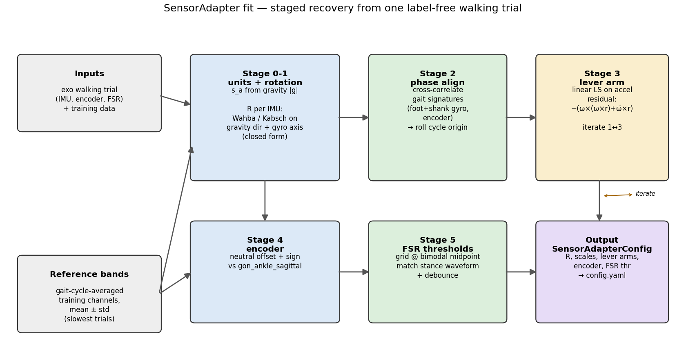
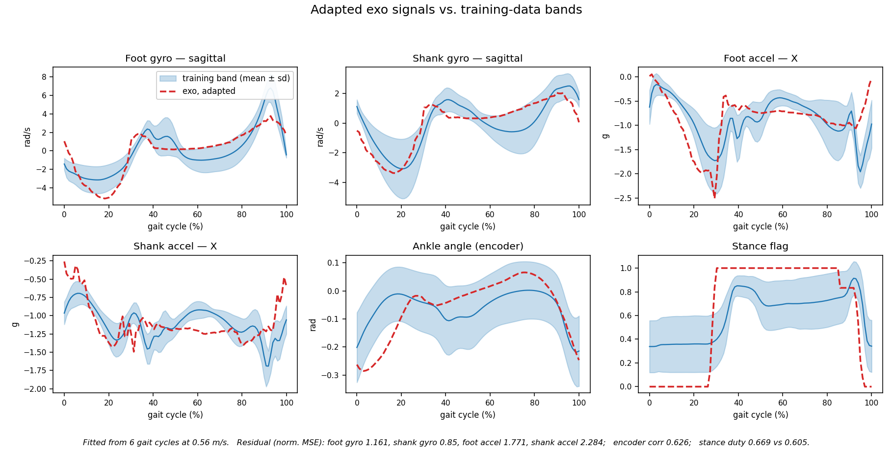

# Sensor-Frame Adaptation: Mapping the Exo's IMUs onto the Training Convention

**Problem.** The torque-prediction model is trained on the Georgia Tech / Camargo
2021 dataset, whose IMUs, goniometers and force plate sit in one fixed
convention. Our exoskeleton's sensors differ: the foot and shank IMUs are mounted
in a different orientation *and location*, the ankle angle comes from an encoder
in degrees (not a goniometer in radians), and ground contact comes from two
force-sensitive resistors (FSRs) instead of a force plate. Feeding raw exo
signals to the model is a train/serve mismatch. The **SensorAdapter** closes it.

**Approach.** We recover the adapter parameters from a single, label-free
**walking recording** by matching the exo's gait-cycle-averaged per-channel
waveforms to reference bands built from the training data. No motion capture, no
torque labels, no manual frame measurement.



---

## 1. Why a rigid (homogeneous) transform is not sufficient

A homogeneous transform — a rotation `R` plus a translation — is the correct model
for **positions**. It is *not* the correct model for what an IMU measures, because
the two channels behave differently under a change of mounting location:

### Gyroscope — translation-invariant

The angular velocity of a rigid body is the same at every point on it. So for the
gyro the mapping is an exact **pure rotation** (plus a unit scale):

```
ω_train(t) = s_g · R · ω_exo(t)                              (3 DOF)
```

### Accelerometer — NOT translation-invariant

An IMU displaced by a lever arm `r` from the segment's reference point also senses
the **centripetal** and **tangential** acceleration of that offset:

```
a_train(t) = s_a · R · a_exo(t)  −  ( ω(t) × (ω(t) × r) + ω̇(t) × r )
```

The `ω × (ω × r)` and `ω̇ × r` terms scale with `‖r‖` and with gait speed (through
`ω`, `ω̇`). Two IMUs 10 cm apart on the same shank read visibly different
accelerations during swing. A rotation-only fit therefore leaves a
**speed-dependent residual** on the accelerometer that only the lever arm `r` can
absorb. This is the core reason the adapter is more than a rotation matrix.

---

## 2. Reference bands from the training data

For a set of training trials we:

1. Segment gait cycles from the foot sagittal gyro (negative-going zero crossings
   of the low-passed, de-trended signal, spaced ≥ 0.6 s apart).
2. Time-normalise each cycle to `P = 100` phase points and average.
3. Store, per channel, the **mean** and **standard deviation** across trials —
   the "band". The std captures inter-subject gait variability and sets the scale
   for a *normalised* residual.

Because the only exo walk available is at **2 km/h (0.56 m/s)** — slower than any
GaTech treadmill trial (0.86–1.29 m/s) — the reference band is restricted to
GaTech's **slowest trials (0.80–0.98 m/s)** so the gait dynamics are as close as
the data allows.

---

## 3. The staged fit

Each stage estimates parameters that the next stage treats as fixed. Ordering is
chosen so every sub-problem is well-conditioned or closed-form.

### Stage 0 — unit scales

| Parameter | Method |
|---|---|
| `s_a` (accel) | Over a walking trial the low-frequency part of the accel vector is dominated by gravity. `s_a = 1 / median(‖lowpass(a_exo)‖)`, mapping the exo's units to *g* (GaTech accel is in *g*, so `‖g‖ = 1`). |
| `s_g` (gyro) | RMS ratio `s_g = RMS(ω_train) / RMS(ω_exo)`. Expected ≈ 1 if both are rad/s; a departure flags a unit error or, as here, a residual speed mismatch. |

### Stage 1 — rotation `R` per IMU (closed form)

Level walking is nearly planar, so the gyro trajectory is close to **one-
dimensional** (pitch). Gyro alone cannot pin the rotation *about* the pitch axis.
The **gravity direction**, carried by the low-frequency accelerometer, supplies
the missing two DOF.

We stack the phase-averaged gravity vectors and gyro vectors as one matched point
set and solve **Wahba's problem** in closed form (Kabsch / SVD of the weighted
cross-covariance, with a sign correction so `det R = +1`):

```
R = argmin_R  Σ_k  w_k ‖ R · p_exo(k) − p_train(k) ‖²
```

where `p` runs over `[gravity direction (P samples); gyro swing axis (P samples)]`.
Both terms are translation-free — gravity is a bias, gyro is translation-invariant
— so this rotation is not contaminated by the lever arm.

Because the exo trial and the reference band may be at different speeds, the gyro
block is normalised to **unit RMS on each side** before stacking, so `R` is driven
by the swing-axis *direction*, not its amplitude. Gravity, being speed-
independent, enters unnormalised and is weighted ~2× (it is the best-conditioned
constraint).

### Stage 2 — phase-origin alignment

The exo heel-strike detector keys off a different gait event than GaTech's
`gcRight` labels, so the two cycle definitions start at different phases. We take
three large, clean gait signatures — foot sagittal gyro, shank sagittal gyro, and
the encoder angle — phase-average each, and find the **circular cross-correlation
lag** that best aligns the exo set to the reference set (jointly, also testing
axis-sign flips). The lag is applied as a roll of the phase axis of every
averaged waveform, so **no gait cycles are lost** (important with only ~6–10
cycles).

For this recording the shift is **70 % of a cycle**.

### Stage 3 — lever arm `r` per IMU (linear least squares)

With `R`, `s_a` fixed and `ω̂(t) = R · s_g · ω_exo(t)`, `ω̇̂ = dω̂/dt` (cycle-time
derivative of the phase average), the accel residual model

```
a_meas(t) − a_train(t)  ≈  −( ω̂ × (ω̂ × r) + ω̇̂ × r )
```

is **linear in `r`**. Stack the 3×3 operator `−([ω̂]×[ω̂]× + [ω̇̂]×)` over all phase
samples, weight by the inverse training-band std, and solve by least squares.
`r` is clamped to `‖r‖ ≤ 30 cm` (physical).

Stages 1 and 3 are **iterated 3×**: the lever-arm correction slightly perturbs the
gravity estimate, so we subtract the current correction from the accel, re-solve
`R`, then re-fit `r`. Converges quickly.

### Stage 4 — encoder

`neutral_deg` and `sign ∈ {+1, −1}` chosen so the encoder cycle-average, converted
to radians, matches the `gon_ankle_sagittal` band. `neutral_deg` removes the mean
offset; `sign` is picked by best waveform match, and the cycle correlation is
reported.

### Stage 5 — FSR thresholds

The exo FSRs are **bimodal** (no-contact cluster near 0, contact cluster near the
ADC ceiling). We search a grid *centred on each sensor's bimodal midpoint* and, for
each `(heel_thr, toe_thr)` pair, form a **debounced** stance flag (minimum
stance/swing dwell time, default 0.10 s) and score it against the GaTech stance
**waveform** in the aligned phase frame:

```
score = 2·‖ stance_exo(φ) − stance_train(φ) ‖²
      + 1·| onset_phase_exo − onset_phase_train |     (circular)
      + 1.5·| duty_exo − duty_train |
      + 0.1·(distance of each threshold from its bimodal midpoint)
```

The last term keeps the thresholds near the robust midpoint when several settings
fit comparably.

---

## 4. Deployment-time behaviour

The fitted parameters live in `configs/default.yaml` under
`deploy.sensor_adapter`. At run time `SensorAdapter` is **stateful**:

- Per IMU it keeps the previous angular velocity so it can form `ω̇` for the
  lever-arm term from a single-sample backward difference.
- The stance flag is a small finite-state machine with the debounce dwell time.
- `ExoController.reset()` clears both.

Per frame: `raw sensor dict → SensorAdapter (this method) → FeaturePipeline
(column order) → ObservationBuffer → TCN (TorchScript / ONNX / TensorRT) →
AssistanceController`.

---

## 5. Results on the available recording

Fit input: `data_collection_20260404_215743_tightshoes_200Hz_2kmph.csv`,
**6 gait cycles at 0.56 m/s**. Reference band: GaTech trials 0.80–0.98 m/s.

**Residual = normalised mean-squared error** (`mean( ((exo − band_mean) /
band_std)² )` over the 100 phase points; ~1.0 means the exo curve is about one
inter-subject standard deviation off the band mean).

| IMU | gyro residual | accel, rotation only | accel, + lever arm | lever arm (cm) |
|---|---|---|---|---|
| Foot | **1.16** | 1.94 | **1.77** | (0.3, −0.2, 0.3) |
| Shank | **0.85** | 3.24 | **2.28** | (−1.1, −0.3, −1.2) |

| Encoder | cycle correlation |
|---|---|
| `gon_ankle_sagittal` | **0.63** |

| FSR | value |
|---|---|
| Heel threshold | 22 446 (modes 4 896 / 25 543) |
| Toe threshold | 8 737 (modes 3 / 17 472) |
| Stance duty | 0.67 (band 0.61) |
| Stance onset phase | 0.28 (band 0.34) |

The lever-arm stage reduces the shank accel residual by ~30 % and the foot accel
residual by ~9 %, confirming the non-rigid term is real (larger for the shank,
which sees higher swing-phase angular rates).

**Qualitative:** after adaptation all 12 IMU channels and the encoder sit within
or adjacent to their bands, and the derived `stance` matches the training
convention (contact through mid-stance to pre-swing).



A 14-panel version covering every channel is written next to the fit output as
`sensor_adapter.png`.

### End-to-end verification

The full control loop was run on the raw exo recording via `run_deploy.py`:

- buffer fills for the first 3 s (300 samples), no output — correct;
- predicted moment ≈ −1.2 to −1.3 N·m/kg peak plantarflexion during stance,
  ≈ 0 during swing — physiologically plausible and consistent with the model's
  held-out test range;
- plantarflexion sign correct, swing gate zeroes the command, peak command
  23 N·m < the 30 N·m limit;
- inference latency (ONNX, CPU): p99 = 1.05 ms vs the 10 ms control budget.

---

## 6. Known limitations and the path to a tighter fit

| Limitation | Effect | Fix |
|---|---|---|
| Only 6 cycles, 0.56 m/s — slower than any training trial | `shank_gyro_scale = 0.81` (should be ≈ 1); elevated shank accel residual; weakly observed lever arm | One **30–60 s exo walk at ~4 km/h** (1.0–1.25 m/s), matching the training speed range |
| Gravity direction comes only from the walking low-pass | 3rd rotational DOF weakly constrained at low speed | A **5 s static-hold recording** → clean 2-DOF gravity constraint per IMU + FSR unloaded baseline (`scripts/calibrate_exo.py`) |
| Residual frame error absorbed downstream | Small systematic bias in predicted torque | Iterative fine-tuning on powered-exo data over assistance levels (risk R1 mitigation) |

`scripts/fit_adapter.py` already consumes both a faster walk and (via
`calibrate_exo.py`) a static hold; running it on those during hardware bring-up
tightens every residual with no code change.

---

## 7. Reproducing / re-running

```bash
# fit from a walking trial, write plot + diagnostics, patch the config in place
python scripts/fit_adapter.py \
    --walk  <exo_walk>.csv \
    --processed <gatech_processed_npz_dir> \
    --out   configs/sensor_adapter.yaml \
    --plot --write-config

# optional prior: static-hold gravity alignment + accel scale + FSR baseline
python scripts/calibrate_exo.py --static <exo_static_hold>.csv \
    --neutral-ankle-deg <encoder reading at neutral pose>
```

Outputs: `sensor_adapter.yaml` (the config block), `sensor_adapter.diagnostics.json`
(all residuals), `sensor_adapter.png` (14-panel band-vs-exo overlay).

---

## 8. One-paragraph summary for a report / slide

> The exoskeleton's foot and shank IMUs, ankle encoder and heel/toe FSRs are
> mapped onto the training-data sensor convention by a **SensorAdapter** whose
> parameters are recovered from a single label-free walking trial. A rigid
> transform is insufficient because the accelerometer is not translation-
> invariant: an IMU offset by a lever arm from the segment reference point senses
> extra centripetal and tangential terms. The fit proceeds in stages — unit
> scales from gravity; a per-IMU rotation from the gravity direction plus the
> gyro swing axis, solved in closed form as Wahba's problem; a phase-origin
> alignment by cross-correlation of gait signatures; a per-IMU lever arm from the
> linear accelerometer residual; and encoder offset and FSR thresholds matched to
> the training stance waveform. Rotation and lever arm are iterated. On the
> available 2 km/h recording the adapted signals lie within one inter-subject
> standard deviation of the training bands on the gyro channels and ~1.8–2.3 on
> the accelerometer channels, the derived stance flag matches the training
> convention, and the full control loop runs end-to-end on real exo data with a
> physiologically plausible torque estimate. A faster walk and a static-hold
> recording will tighten the fit further.
